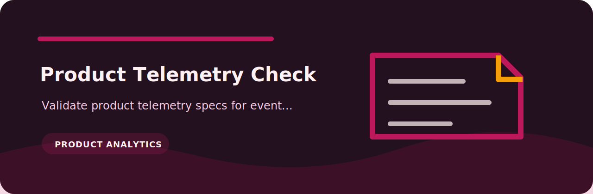

# Product Telemetry Check



> Validate product telemetry specs for event name, properties, and privacy review

   

## At a glance

| Area | Detail |
| --- | --- |
| Focus | product analytics |
| Command | `product-telemetry-check` |
| Formats | text, JSON, JSONL, CSV |
| Output | Markdown table or JSON |

## What it checks

| Rule | Severity | What it catches |
| --- | --- | --- |
| `missing-event-name` | high | event name missing |
| `missing-properties` | medium | properties missing |
| `privacy-unchecked` | low | privacy review missing |

## Try it locally

```bash
python -m pip install -e ".[dev]"
product-telemetry-check examples/sample.txt
product-telemetry-check examples/sample.txt --json --fail-on medium
```

## Notes from the code

`rules.py` keeps the project policy explicit, while `core.py` handles parsing and report rendering. The CLI stays thin on purpose so the checks are easy to test.

## Verify

```bash
python -m pip install -e ".[dev]"
ruff check .
pytest
python -m product_telemetry_check --help
```
