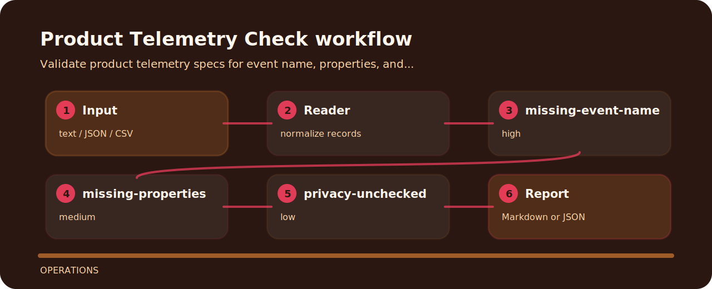

# Product Telemetry Check

Validate product telemetry specs for event name, properties, and privacy review.


## Signal route



## Review intent

- Targets product analytics instead of broad linting.
- Accepts plain text and returns terminal findings, optional json.
- Keeps each rule visible so the project can be tuned without hunting through prose.

## What gets flagged

- `missing-event-name` - event name missing (high); define stable event name.
- `missing-properties` - properties missing (medium); declare event properties.
- `privacy-unchecked` - privacy review missing (low); review privacy impact.

## Run the sample

```bash
git clone https://github.com/mertefekurt/product-telemetry-check.git
cd product-telemetry-check
python -m pip install -e ".[dev]"
product-telemetry-check examples/sample.txt
```
